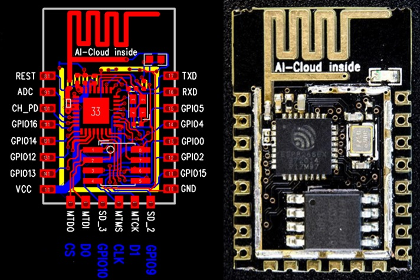
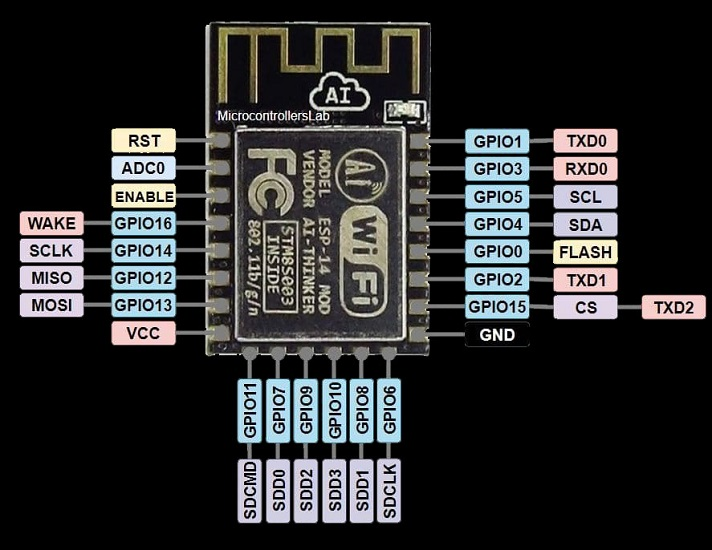

# Special Pins of ESP8266

To start the ESP8266, certain pins must be in a specific state (HIGH or LOW). These pins are:

**RST, Enable, GPIO0, GPIO2, GPIO15, GPIO16**

- The **RST** pin must be pulled up; otherwise, due to its high sensitivity, any noise may cause the ESP8266 to reset.
- The **Enable** pin must also be pulled up; otherwise, the ESP8266 will not power up.
- The **GPIO0** pin must be pulled up; otherwise, if it is LOW during startup, the ESP8266 will enter BootLoader mode.
- The **GPIO2** pin is connected to the ESP8266's internal LED. If it is LOW during startup (used as input), the ESP8266 will not boot.
- The **GPIO15** pin must be pulled down; otherwise, the ESP8266 will not boot.
- The **GPIO16** pin is used to wake the ESP8266 from Sleep mode and should be connected to the RST pin.

## Dual-purpose Pins (Input/Output)
For input and output purposes, you can use the following pins without any issues:
- GPIO4
- GPIO5
- GPIO12
- GPIO13
- GPIO1

These pins remain unchanged during the startup of the ESP8266 and can be used without any problems for connecting outputs like relays.
Note: GPIO12, GPIO13, GPIO14, and GPIO15 are related to SPI communication.

## Output Pins
The following pins can be used as output:
- GPIO0
- GPIO1
- GPIO2
- GPIO15

However, these pins change their status during the ESP8266 startup. For instance, if connected to a relay, the output may change, so use these pins as output with caution.
To use the serial communication pin GPIO1 (TXD) as output, transmission communication should not be used throughout the program and should not be configured.
The GPIO0 and GPIO2 pins must be pulled up during the ESP8266's initial startup; otherwise, it won't boot.
GPIO15 pin must be pulled down initially; otherwise, the ESP8266 will not power up.

## Input Pins
The following pins can be used as input:
- GPIO0
- GPIO2
- GPIO3
- A0

To use the serial communication pin GPIO3 (RXD) as input, transmission communication should not be used throughout the program and should not be configured.
The GPIO0 and GPIO2 pins must be pulled up during the ESP8266's initial startup; otherwise, it won't boot, and if they are low during startup, it will not power up.
The analog input pin can also be used as a digital input, but you can only apply a logical 1 level to pin A0, and unlike other ESP8266 pins, this level is equal to 1 volt. 
Additionally, you can only apply a voltage range of 0 to 1 volt to the analog pin on the ESP8266, and a voltage divider should be used to prevent damage to the ESP8266.

## Neither Input Nor Output Pins
The following pins are related to the Flash IC and should not be configured as IO; otherwise, the ESP8266 operation may be disrupted, causing instability:
- GPIO6
- GPIO7
- GPIO8
- GPIO9
- GPIO10
- GPIO11

## Boot Modes
The ESP8266 has different boot modes that are selected based on the voltage levels applied to certain GPIO pins during power-up.

| GPIO15 | GPIO0 | GPIO2 | Mode                           |
|--------|-------|-------|--------------------------------|
| 0V     | 0V    | 3.3V  | Uart Bootloader                |
| 0V     | 3.3V  | 3.3V  | Boot sketch (SPI flash)        |
| 3.3V   | x     | x     | SDIO mode (not used for Arduino) |

1. **Uart Bootloader Mode:**
   - **Purpose:** This mode is used for flashing the firmware onto the ESP8266 via the UART interface.
   - **GPIO Configuration:** 
     - GPIO15 = 0V
     - GPIO0 = 0V
     - GPIO2 = 3.3V

2. **Boot Sketch (SPI Flash) Mode:**
   - **Purpose:** This is the standard mode for running the user program stored in the SPI flash memory.
   - **GPIO Configuration:** 
     - GPIO15 = 0V
     - GPIO0 = 3.3V
     - GPIO2 = 3.3V

3. **SDIO Mode:**
   - **Purpose:** This mode is not commonly used for Arduino applications.
   - **GPIO Configuration:** 
     - GPIO15 = 3.3V
     - GPIO0 = x (don't care)
     - GPIO2 = x (don't care)
     
These boot conditions must be maintained by using appropriate external resistors or relying on those provided by the board manufacturer. 
Failing to meet these conditions can result in improper booting or entering unintended boot modes.
By understanding and correctly configuring these pins, you can ensure that your ESP8266 boots into the desired mode and operates reliably.

## Notes
- **GPIO15:** Always pulled low (0V) for standard operation modes. Internal pull-up resistor cannot be used.
- **GPIO0:** Pulled high (3.3V) for normal operation. Using it as a Hi-Z input is not possible.
- **GPIO2:** Should not be low at boot. You can’t connect a switch directly to this pin without causing boot issues.
- You don’t have to add an external pull-up resistor to GPIO2, the internal one is enabled at boot.
- The serial communication pins (**GPIO1**, **GPIO3**) are initially HIGH when the ESP8266 is powered up.
- The reliable pins for output are **GPIO4** and **GPIO5**.
- All ESP8266 pins, except **GPIO16**, support interrupts.
- All ESP8266 pins can function as 10-bit software PWM.

