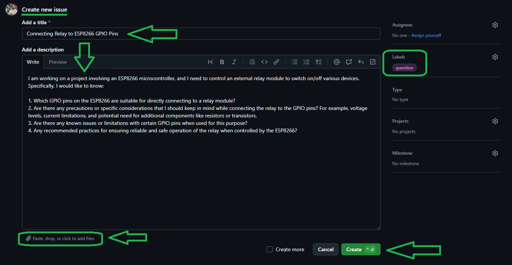
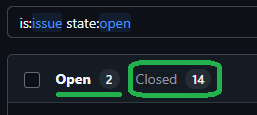

# 💻 How to Use Git and GitHub

First, open **Git Bash** :
-  Open the folder in **File Explorer** where you want the library to be stored.
-  **Right-click** inside the folder and select the option **"Open Git Bash here"** to open **Git Bash** in that directory.


> Note: If you do not see the "Open Git Bash here" option, it means that Git is not installed on your system.
> 
>  You can download and install Git from [this link](https://git-scm.com/downloads).
>  
>  For a tutorial on how to install and use Git, check out [this video](https://youtu.be/BsykgHpmUt8).
  
-  Once **Git Bash** is open, run the following command to clone the repository:

 ```bash
git clone https://github.com/aKaReZa75/ESP8266
```
- You can copy the above command by either:
- Clicking on the **Copy** button on the right of the command.
- Or select the command text manually and press **Ctrl + C** to copy.
- To paste the command into your **Git Bash** terminal, use **Shift + Insert**.


- Then, press Enter to start the cloning operation and wait for the success message to appear.


**Note:** Please keep in mind that the numbers displayed in the image might vary when you perform the same actions. This is because repositories are continuously being updated and expanded. Nevertheless, the overall process remains unchanged.

# Special Pins of ESP8266


To start the ESP8266, certain pins must be in a specific state (HIGH or LOW). These pins are:

**RST, Enable, GPIO0, GPIO2, GPIO15, GPIO16**

- The **RST** pin must be pulled up; otherwise, due to its high sensitivity, any noise may cause the ESP8266 to reset.
- The **Enable** pin must also be pulled up; otherwise, the ESP8266 will not power up.
- The **GPIO0** pin must be pulled up for normal operation; otherwise, if it is LOW during startup, the ESP8266 will enter BootLoader mode (for flashing firmware).
- The **GPIO2** pin must be pulled up; if LOW during startup (used as input), the ESP8266 may fail to boot. The internal LED is also connected to this pin.
- The **GPIO15** pin must be pulled down; otherwise, the ESP8266 will not boot.
- The **GPIO16** pin is used to wake the ESP8266 from Deep Sleep mode and must be connected to RST for this function.

**Note**: In some ESP8266 modules, the internal LED is not connected to GPIO2 but to GPIO1 (TXD), such as in the ESP-12E module. Always verify the specific version of the ESP8266 you are using, as the LED may be connected to either GPIO2 or GPIO1 depending on the board.

## Dual-purpose Pins (Input/Output)
For input and output purposes, you can use the following pins without any issues:
- GPIO4
- GPIO5
- GPIO12
- GPIO13
- GPIO14

These pins remain unchanged during the startup of the ESP8266 and can be used without any problems for connecting outputs like relays.
Note: GPIO12, GPIO13, GPIO14, and GPIO15 are related to SPI communication.

## Output Pins
The following pins can be used as output:
- GPIO0
- GPIO1
- GPIO2
- GPIO15

However, these pins change their state during startup, which may cause unwanted behavior in connected components like relays, so use these pins as output with caution.
To use the serial communication pin GPIO1 (TXD) as output, transmission communication should not be used throughout the program and should not be configured.
The GPIO0 and GPIO2 pins must be pulled up during the ESP8266's initial startup; otherwise, it won't boot.
GPIO15 pin must be pulled down initially; otherwise, the ESP8266 will not power up.

## Input Pins
The following pins can be used as input:
- GPIO0
- GPIO2
- GPIO3
- A0

To use the serial communication pin GPIO3 (RXD) as input, transmission communication should not be used throughout the program and should not be configured, otherwise this pin can be used as an input only if UART communication is not required.
The GPIO0 and GPIO2 pins must be pulled up during the ESP8266's initial startup; otherwise, it won't boot, and if they are low during startup, it will not power up.
The analog input pin can also be used as a digital input, and unlike other ESP8266 pins, this level is equal to 1 volt. 
Additionally, you can only apply a voltage range of 0 to 1 volt to the analog pin on the ESP8266, and a voltage divider should be used to prevent damage to the ESP8266.

## Analog Input Pins
The ESP8266 features a single analog input pin, labeled **A0**. 
This pin is used for reading analog voltage levels and converting them into digital values using an ADC (Analog-to-Digital Converter). 

**Note:** On some development boards like NodeMCU, a built-in voltage divider allows up to 3.3V.

### Specifications
- **Resolution**: 10-bit ADC (0 to 1023)
- **Voltage Range**: 0 to 1V
- **Accuracy**: Typically around ±2 LSB (Least Significant Bits)

**Note:** The **A0** pin only supports voltage levels between 0 to 1V. Voltages higher than 1V may damage the ESP8266. Use a voltage divider circuit to scale down higher voltage levels to the 0-1V range.

### Voltage Conversion 
To convert ADC values to voltage, use the following macro:
```c
#define ADC_TO_VOLTAGE(adc_value) ((adc_value) * (1.0 / 1023.0))
```
However, for better computational efficiency on microcontrollers, it's recommended to use the following form:
```c
#define ADC_TO_VOLTAGE(adc_value) (adc_value * 0.0098039)  /**< 0.0098039 = 1/1023 */
```
**Reason:** By using the constant 0.0098039 directly, the microcontroller avoids performing a division operation, which is computationally more expensive. 
Instead, it only needs to perform multiplication, which is faster and more efficient. This can lead to improved performance, especially in applications where ADC readings are taken frequently.

### Voltage Dvider
For a typical voltage divider circuit to convert 3.3V to 1V:
```plaintext
Vin (Input Voltage)
  |
 R1
  |
  +----> A0 (Analog Pin of ESP8266)
  |
 R2
  |
 GND (Ground)

```
**Formula**:  
$$V_{\text{out}} = V_{\text{in}} \times \frac{R2}{R1 + R2}$$

**Substitute Values**:  
$$1.0V = 5V \times \frac{R2}{R1 + R2}$$

**Assuming**:  
- Assume \( R2 = 10kΩ \)

**Solve for R1**:  
$$\frac{R1}{R2} = \frac{V_{\text{in}}}{V_{\text{out}}} - 1 = \frac{5}{1} - 1 = 4$$  
$$R1 = 4 \times R2 = 4 \times 10kΩ = 40kΩ$$

**Standard Resistors**:  
- R1 = 39kΩ (nearest standard value)
- R2 = 10kΩ  

**Verification**:  
$$V_{\text{out}} = 5V \times \frac{10kΩ}{39kΩ + 10kΩ} = 1.02V$$

### **Summary Table**  
| Input Voltage | R1    | R2    | Calculated Vout | Voltage Formula |
|---------------|-------|-------|-----------------| -----------------| 
| 3.3V          | 22kΩ  | 10kΩ  | 1.03V           | adc_value * 0.0032258‬ | 
| 5V            | 39kΩ  | 10kΩ  | 1.02V           | adc_value * 0.0048876 |  
| 12V           | 110kΩ  | 10kΩ | 1.0V            | adc_value * 0.0117302 |  
                                                                
## Neither Input Nor Output Pins
The following pins are related to the Flash IC and should not be configured as IO; otherwise, the ESP8266 operation may be disrupted, causing instability:
- GPIO6
- GPIO7
- GPIO8
- GPIO9
- GPIO10
- GPIO11

## Boot Modes
The ESP8266 has different boot modes that are selected based on the voltage levels applied to certain GPIO pins during power-up.

| GPIO15 | GPIO0 | GPIO2 | Mode                            |
|--------|-------|-------|---------------------------------|
| LOW    | LOW   | HIGH  | Uart Bootloader                 |
| LOW    | HIGH  | HIGH  | Boot sketch (SPI flash)         |
| HIGH   | x     | x     | SDIO mode                       |

1. **Uart Bootloader Mode:**
   - **Purpose:** This mode is used for flashing the firmware onto the ESP8266 via the UART interface.
   - **GPIO Configuration:** 
     - GPIO15 = 0V
     - GPIO0 = 0V
     - GPIO2 = 3.3V

2. **Boot Sketch (SPI Flash) Mode:**
   - **Purpose:** This is the standard mode for running the user program stored in the SPI flash memory.
   - **GPIO Configuration:** 
     - GPIO15 = 0V
     - GPIO0 = 3.3V (Pull-up)
     - GPIO2 = 3.3V

3. **SDIO Mode:**
   - **Purpose:** This mode is not commonly used for Arduino applications.
   - **GPIO Configuration:** 
     - GPIO15 = 3.3V 
     - GPIO0 = x (don't care)
     - GPIO2 = x (don't care)
- Caution: GPIO15 must be **HIGH** for this mode, but most boards hardwire GPIO15 to GND.     

These boot conditions must be maintained by using appropriate external resistors or relying on those provided by the board manufacturer. 
Failing to meet these conditions can result in improper booting or entering unintended boot modes.
By understanding and correctly configuring these pins, you can ensure that your ESP8266 boots into the desired mode and operates reliably.

## Notes
- **GPIO15:** Floating GPIO15 (no pull-down) causes boot failure. Always pulled low (0V) for standard operation modes. If using an ESP8266 module like ESP-12, check if an internal 5KΩ pull-down resistor is present. Otherwise, add an external 10KΩ resistor to GND.
- **GPIO0:** Pulled high (3.3V) for normal operation. Using it as a Hi-Z input is not possible. A direct switch to GND may cause boot issues.
- **GPIO2:** Should not be low at boot. You can’t connect a switch directly to this pin without causing boot issues.
- You don’t have to add an external pull-up resistor to GPIO2, the internal one is enabled at boot.
- The serial communication pins (**GPIO1**, **GPIO3**) are initially HIGH when the ESP8266 is powered up.
- The reliable pins for output are **GPIO4** and **GPIO5**.
- All ESP8266 pins, except **GPIO16**, support interrupts.
- **GPIO16** Supports **interrupts**, but only for waking from **Deep Sleep** (not general-purpose interrupts).  
- All ESP8266 pins support 10-bit software PWM.
- The SPI communication pins are (**GPIO12 (MISO)**, **GPIO13 (MOSI)**, **GPIO14 (SCK)**, **GPIO14 (SCK)**, **GPIO15 (CS)**) but **GPIO15** must be LOW during boot but can be used as SPI CS after boot.

# ESP8266 Pinout & Description

| **Pin**  | **Default Function**  | **Alternate Functions** | **Description** | **Important Notes** |
|----------|----------------------|------------------------|-----------------|-----------------|
| **VCC**  | Power Supply | - | 3.3V power input | Maximum current: 500mA |
| **GND**  | Ground | - | Connect to circuit ground | Essential for stable operation |
| **EN (CH_PD)** | Chip Enable | - | Activates the ESP8266 | Must be **High (3.3V)** to power up |
| **RST**  | Reset | - | A **Low** pulse resets the module | Must be **Pull-up (3.3V)** for stable operation |
| **GPIO0** | General Purpose I/O | Boot Mode Selection | Controls boot mode | Must be **Pull-up (3.3V)** for normal boot |
| **GPIO1** | TXD (UART0) | General Purpose Output | UART TX pin | Defaults to **High** at boot |
| **GPIO2** | General Purpose I/O | Boot Mode Selection, I2C SDA | Used for boot mode selection | Must be **Pull-up (3.3V)** for normal boot |
| **GPIO3** | RXD (UART0) | General Purpose Input, I2C SCL | UART RX pin | Defaults to **High** at boot |
| **GPIO4** | General Purpose I/O | I2C (SDA) | Usable I/O pin | No boot restrictions |
| **GPIO5** | General Purpose I/O | I2C (SCL) | Usable I/O pin | No boot restrictions |
| **GPIO6** | SPI_CLK (Flash) | - | Connected to Flash memory | **Do not use for I/O** |
| **GPIO7** | SPI_MISO (Flash) | - | Connected to Flash memory | **Do not use for I/O** |
| **GPIO8** | SPI_MOSI (Flash) | - | Connected to Flash memory | **Do not use for I/O** |
| **GPIO9** | SPI_HD (Flash) | - | Connected to Flash memory | **Do not use for I/O** |
| **GPIO10** | SPI_WP (Flash) | - | Connected to Flash memory | **Do not use for I/O** |
| **GPIO11** | SPI_CS (Flash) | - | Connected to Flash memory | **Do not use for I/O** |
| **GPIO12** | General Purpose I/O | SPI_MISO | Usable I/O pin | No boot restrictions |
| **GPIO13** | General Purpose I/O | SPI_MOSI | Usable I/O pin | No boot restrictions |
| **GPIO14** | General Purpose I/O | SPI_CLK | Usable I/O pin | No boot restrictions |
| **GPIO15** | Boot Mode Selection | SPI_CS  | Required for boot mode selection | Must be **Pull-down (GND)** for normal boot |
| **GPIO16** | Wake from Deep Sleep | - | Used for waking from deep sleep | **Must be connected to RST** for wake-up from Deep Sleep |
| **A0** | ADC (Analog Input) | - | Analog input pin | Voltage range **0V - 1V** only |

# Minimal Hardware Setup for ESP8266
This guide explains the minimal required hardware setup to power up and properly boot the ESP8266. It ensures stable operation and avoids unexpected boot failures.

## 1. Required Components
To get the ESP8266 up and running, you need the following components:
- **ESP8266 Module** (e.g., ESP-12E, ESP-12F, ESP-01)
- **3.3V Power Supply** (capable of providing at least 500mA)
- **Capacitors**: 100µF + 100nF (for power stability)
- **Pull-up Resistors** (10kΩ) for EN, RST, GPIO0, and GPIO2
- **Pull-down Resistor** (10kΩ) for GPIO15
- **Momentary Push Button** (for RESET and BOOT mode)
- **USB-to-Serial Adapter** (for programming, e.g., CP2102, CH340)

## 2. Minimal Wiring Setup
### ESP8266 Power Connections
| Pin  | Connection  |
|------|------------|
| **VCC**  | 3.3V (⚠️ Do NOT use 5V, it will damage the ESP8266) |
| **GND**  | Ground |

### Boot & Reset Circuit
| Pin   | Connection  | Purpose  |
|-------|------------|----------|
| **EN (CH_PD)**  | 10kΩ Pull-up to 3.3V | Enable ESP8266 |
| **RST**         | 10kΩ Pull-up to 3.3V + Push Button to GND | Reset the ESP8266 |
| **GPIO0**       | 10kΩ Pull-up to 3.3V + Push Button to GND | Must be HIGH for normal boot, LOW for flashing |
| **GPIO2**       | 10kΩ Pull-up to 3.3V | Must be HIGH during boot |
| **GPIO15**      | 10kΩ Pull-down to GND | Must be LOW during boot |
| **GPIO16**      | Connect to RST | Wakes ESP8266 from Deep Sleep |

Important Notes:
- After entering **Deep Sleep Mode**, the ESP8266 can only wake up if **GPIO16** is connected to **RST**.
- If you are not using Deep Sleep, leave **GPIO16** unconnected.
- Do not use **GPIO16** as an input with an external pull-up/down resistor, as it may interfere with sleep/wake functionality.

### Programming & Communication
| Pin  | Connection |
|------|------------|
| **TXD (GPIO1)**   | Connect to RX of USB-to-Serial adapter |
| **RXD (GPIO3)**   | Connect to TX of USB-to-Serial adapter |
| **GND**           | Connect to GND of USB-to-Serial adapter |

## 3. Boot Modes
ESP8266 supports different boot modes based on GPIO states at startup:

| GPIO15 | GPIO0 | GPIO2 | Mode  |
|--------|-------|-------|--------------------|
| 0V     | 0V    | 3.3V  | Flash Mode (UART) |
| 0V     | 3.3V  | 3.3V  | Normal Boot (SPI Flash) |

- **Normal Boot Mode**: Runs user firmware from flash memory.
- **Flash Mode**: Used for uploading firmware via UART.

## 4. Power Considerations
- **Stable 3.3V Power Supply**: ESP8266 can draw up to **300-500mA** during Wi-Fi operations. A weak power source may cause resets.
- **Decoupling Capacitors**: Add **10µF + 0.1µF** nethe **VCC** pin for noise filtering.

## 5. Common Issues & Fixes
| Issue                        | Cause                                    | Solution                                            |
|------------------------------|------------------------------------------|-----------------------------------------------------|
| ESP8266 keeps resetting      | Unstable power                           | Use a proper 3.3V regulator and capacitors          |
| ESP8266 does not boot        | GPIO0, GPIO2, or GPIO15 misconfigured    | Check pull-up and pull-down resistors               |
| Garbage data on Serial Monitor | Wrong baud rate                         | Set baud rate to **115200** or **74880**            |
| Cannot upload code           | GPIO0 not LOW during upload              | Hold GPIO0 LOW while resetting                      |
| WiFi connection issues       | Weak WiFi signal or incorrect credentials | Move closer to the router or check WiFi credentials  |
| Flashing errors              | Insufficient power or incorrect connections | Ensure stable power supply and correct wiring       |
| High power consumption       | Deep sleep mode not enabled              | Enable deep sleep mode to save power                |
| Overheating                  | Poor ventilation                         | Ensure proper ventilation and heat dissipation      |
| GPIO pins not working        | Incorrect pin mode configuration         | Set correct pin mode (INPUT/OUTPUT) in the code     |
| Connection drops             | Interference or power fluctuations       | Reduce interference sources and ensure stable power |

## 6. Minimal Schematic
Here is a simplified schematic for stable ESP8266 operation:


To flash firmware onto the ESP8266, you need to place it into programming mode. This requires setting the GPIO0 pin to LOW while resetting the module. Here is the step-by-step process:
- **Step 1**: Press and hold both buttons **P1 (RST)** and **P2 (GPIO 0)**.
- **Step 2**: While keeping **P1 (RST)** pressed, release **P2 (GPIO 0)**.
- **Step 3**: Finally, release **P1 (RST)**.
- **Step 4**: Upload the firmware.
- **Step 5**: After uploading, press **P1 (RST)** once more to restart the ESP8266 and run 


This schematic of the ESP8266 module has been edited in **[my Library](https://github.com/aKaReZa75/Altium-Library)**. 
The pin names are clearly labeled, and the order has been rearranged for easier access. 
Additionally, restriction pins have been removed from the schematic to prevent design errors. 
For access to this library, please refer to the following repository:
[aKaReZa Altium-Library](https://github.com/aKaReZa75/Altium-Library)

## 7. Conclusion
By following this minimal hardware setup, you can ensure that your ESP8266 boots up correctly and operates without issues. 
This setup is essential for both the development and deployment of ESP8266-based projects.

# 📝 How to Ask Questions
If you have any questions or issues, you can raise them through the "Issues" section of this repository. Here's how you can do it:

1. Navigate to the "Issues" tab at the top of the repository page.

  

3. Click on the "New Issue" button.
   
  

4. In the "Description" field, detail your question or issue as thoroughly as possible. You can use text formatting, attach files, and assign the issue to someone if needed.
5. Optionally, you can add labels, type, projects, and milestones to your issue for better categorization.
6. Click on the "Submit new issue" button to post your 
   
  

I will review and respond to your issue as soon as possible. Your participation helps improve the repository for everyone!

Once your question is answered, it will be moved to the "Closed" section. I recommend checking the "Closed" issues first to see if someone else has already asked the same question. This might save you time and provide you with an immediate answer.

  

**Note:** Pages and interfaces may change over time, but the steps to create an issue generally remain the same.

# 🤝 Contributing to the Repository
If you want to update or modify the Repository:
- Fork this repository.
- Make your changes in a new branch.
- Submit a **Pull Request** with a detailed description of your changes.

# 🌟 Support Me
If you found this repository useful:
- Subscribe to my [YouTube Channel](https://www.youtube.com/@aKaReZa75).
- Share this repository with others.
- Give this repository and my other repositories a star.
- Follow my [GitHub account](https://github.com/aKaReZa75).

# 📜 License
This project is licensed under the GPL-3.0 License. This license grants you the freedom to use, modify, and distribute the project as long as you:
- Credit the original authors: Give proper attribution to the original creators.
- Disclose source code: If you distribute a modified version, you must make the source code available under the same GPL license.
- Maintain the same license: When you distribute derivative works, they must be licensed under the GPL-3.0 too.
- Feel free to use it in your projects, but make sure to comply with the terms of this license.
  
# ✉️ Contact Me
Feel free to reach out to me through any of the following platforms:
- 📧 [Email: aKaReZa75@gmail.com](mailto:aKaReZa75@gmail.com)
- 🎥 [YouTube: @aKaReZa75](https://www.youtube.com/@aKaReZa75)
- 💼 [LinkedIn: @akareza75](https://www.linkedin.com/in/akareza75)
