# Minimal Hardware Setup for ESP8266
This guide explains the minimal required hardware setup to power up and properly boot the ESP8266. It ensures stable operation and avoids unexpected boot failures.

## 1. Required Components
To get the ESP8266 up and running, you need the following components:
- **ESP8266 Module** (e.g., ESP-12E, ESP-12F, ESP-01)
- **3.3V Power Supply** (capable of providing at least 500mA)
- **Capacitors**: 100µF + 100nF (for power stability)
- **Pull-up Resistors** (10kΩ) for EN, RST, GPIO0, and GPIO2
- **Pull-down Resistor** (10kΩ) for GPIO15
- **Momentary Push Button** (for RESET and BOOT mode)
- **USB-to-Serial Adapter** (for programming, e.g., CP2102, CH340)

## 2. Minimal Wiring Setup
### ESP8266 Power Connections
| Pin  | Connection  |
|------|------------|
| **VCC**  | 3.3V (⚠️ Do NOT use 5V, it will damage the ESP8266) |
| **GND**  | Ground |

### Boot & Reset Circuit
| Pin   | Connection  | Purpose  |
|-------|------------|----------|
| **EN (CH_PD)**  | 10kΩ Pull-up to 3.3V | Enable ESP8266 |
| **RST**         | 10kΩ Pull-up to 3.3V + Push Button to GND | Reset the ESP8266 |
| **GPIO0**       | 10kΩ Pull-up to 3.3V + Push Button to GND | Must be HIGH for normal boot, LOW for flashing |
| **GPIO2**       | 10kΩ Pull-up to 3.3V | Must be HIGH during boot |
| **GPIO15**      | 10kΩ Pull-down to GND | Must be LOW during boot |
| **GPIO16**      | Connect to RST | Wakes ESP8266 from Deep Sleep |

Important Notes:
- After entering **Deep Sleep Mode**, the ESP8266 can only wake up if **GPIO16** is connected to **RST**.
- If you are not using Deep Sleep, leave **GPIO16** unconnected.
- Do not use **GPIO16** as an input with an external pull-up/down resistor, as it may interfere with sleep/wake functionality.

### Programming & Communication
| Pin  | Connection |
|------|------------|
| **TXD (GPIO1)**   | Connect to RX of USB-to-Serial adapter |
| **RXD (GPIO3)**   | Connect to TX of USB-to-Serial adapter |
| **GND**           | Connect to GND of USB-to-Serial adapter |

## 3. Boot Modes
ESP8266 supports different boot modes based on GPIO states at startup:

| GPIO15 | GPIO0 | GPIO2 | Mode  |
|--------|-------|-------|--------------------|
| 0V     | 0V    | 3.3V  | Flash Mode (UART) |
| 0V     | 3.3V  | 3.3V  | Normal Boot (SPI Flash) |

- **Normal Boot Mode**: Runs user firmware from flash memory.
- **Flash Mode**: Used for uploading firmware via UART.

## 4. Power Considerations
- **Stable 3.3V Power Supply**: ESP8266 can draw up to **300-500mA** during Wi-Fi operations. A weak power source may cause resets.
- **Decoupling Capacitors**: Add **10µF + 0.1µF** are the **VCC** pin for noise filtering.

## 5. Common Issues & Fixes
| Issue                        | Cause                                    | Solution                                            |
|------------------------------|------------------------------------------|-----------------------------------------------------|
| ESP8266 keeps resetting      | Unstable power                           | Use a proper 3.3V regulator and capacitors          |
| ESP8266 does not boot        | GPIO0, GPIO2, or GPIO15 misconfigured    | Check pull-up and pull-down resistors               |
| Garbage data on Serial Monitor | Wrong baud rate                         | Set baud rate to **115200** or **74880**            |
| Cannot upload code           | GPIO0 not LOW during upload              | Hold GPIO0 LOW while resetting                      |
| WiFi connection issues       | Weak WiFi signal or incorrect credentials | Move closer to the router or check WiFi credentials  |
| Flashing errors              | Insufficient power or incorrect connections | Ensure stable power supply and correct wiring       |
| High power consumption       | Deep sleep mode not enabled              | Enable deep sleep mode to save power                |
| Overheating                  | Poor ventilation                         | Ensure proper ventilation and heat dissipation      |
| GPIO pins not working        | Incorrect pin mode configuration         | Set correct pin mode (INPUT/OUTPUT) in the code     |
| Connection drops             | Interference or power fluctuations       | Reduce interference sources and ensure stable power |

## 6. Minimal Schematic
Here is a simplified schematic for stable ESP8266 operation:

To flash firmware onto the ESP8266, you need to place it into programming mode. This requires setting the GPIO0 pin to LOW while resetting the module. Here is the step-by-step process:
- **Step 1**: Press and hold both buttons **P1 (RST)** and **P2 (GPIO 0)**.
- **Step 2**: While keeping **P1 (RST)** pressed, release **P2 (GPIO 0)**.
- **Step 3**: Finally, release **P1 (RST)**.
- **Step 4**: Upload the firmware.
- **Step 5**: After uploading, press **P1 (RST)** once more to restart the ESP8266 and run 

```mermaid
gantt
    title Booting ESP8266 into Programming Mode (USART)
    dateFormat  HH:mm:ss
    section Steps
    Press and hold P1 (RST) and P2 (GPIO 0)        :done,       p1p2, 00:00:01, 1s
    Release P2 (GPIO 0) while keeping P1 (RST) pressed :done,    p2,   after p1p2, 1s
    Then Release P1 (RST)                              :done,       p1,   after p2, 1s
    Start uploading the firmware                    :active,     upload, after p1, 3s
    Wait for the firmware upload to complete        :active,     wait,  after upload, 5s
    Press P1 (RST) to restart and run the code      :active,     restart, after wait, 1s
```

This schematic of the ESP8266 module has been edited in **[my Library](https://github.com/aKaReZa75/Altium-Library)**. 
The pin names are clearly labeled, and the order has been rearranged for easier access. 
Additionally, restriction pins have been removed from the schematic to prevent design errors. 
For access to this library, please refer to the following repository:
[aKaReZa Altium-Library](https://github.com/aKaReZa75/Altium-Library)

## 7. Conclusion
By following this minimal hardware setup, you can ensure that your ESP8266 boots up correctly and operates without issues. 
This setup is essential for both the development and deployment of ESP8266-based projects.

# 🤝 Contributing to the Repository
To contribute to this repository, please follow these steps:
1. **Fork the Repository**  
2. **Clone the Forked Repository**  
3. **Create a New Branch**  
4. **Make Your Changes**  
5. **Commit Your Changes**  
6. **Push Your Changes to Your Forked Repository**  
7. **Submit a Pull Request (PR)**  

> [!NOTE]
> Please ensure your pull request includes a clear description of the changes you’ve made.
> Once submitted, I will review your contribution and provide feedback if necessary.

# 🌟 Support Me
If you found this repository useful:
- Subscribe to my [YouTube Channel](https://www.youtube.com/@aKaReZa75).
- Share this repository with others.
- Give this repository and my other repositories a star.
- Follow my [GitHub account](https://github.com/aKaReZa75).

# 📜 License
This project is licensed under the GPL-3.0 License. This license grants you the freedom to use, modify, and distribute the project as long as you:
- Credit the original authors: Give proper attribution to the original creators.
- Disclose source code: If you distribute a modified version, you must make the source code available under the same GPL license.
- Maintain the same license: When you distribute derivative works, they must be licensed under the GPL-3.0 too.
- Feel free to use it in your projects, but make sure to comply with the terms of this license.
  
# ✉️ Contact Me
Feel free to reach out to me through any of the following platforms:
- 📧 [Email: aKaReZa75@gmail.com](mailto:aKaReZa75@gmail.com)
- 🎥 [YouTube: @aKaReZa75](https://www.youtube.com/@aKaReZa75)
- 💼 [LinkedIn: @akareza75](https://www.linkedin.com/in/akareza75)